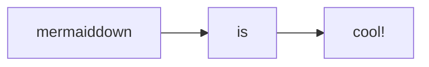

# Mermaiddown
Mermaiddown is a wrapper for [mermaid.cli] that targets markdown. Markdown files get parsed, and fenced mermaid code blocks
(`\`\`\`mermaid \`\`\``) get replaced with their corresponding mermaid diagrams in SVG format.

Inspired by the amazing concepts underlying the visual studio plugin [Markdown Preview Mermaid Support].

Was originally hoping to embed the SVGs directly so the links worked ... seems like you can't do that on github :(



## Usage
`cat myfile.md | npx mermaiddown > out.md`

Fenced areas meeting this form are used:
```markdown
    ```mermaid
    %%%% Example Diagram    %%%%
    %%%% assets/example.svg %%%%
    graph TD;
        a["mermaiddown"];
        click a "#mermaiddown";
        b["is"];
        c["cool!"];

        a --> b;
        b --> c;
    ````
```

## Configuration
mermaiddown just wraps mermaid.cli, so the options are the same. Use `-h` to see them.

In this case, the title of the image becomes 'Example Diagram',
and it is rendered to `assets/example.svg`.

[mermaid.cli]: https://npm.com/package/mermaid.cli
[Markdown Preview Mermaid Support]: https://marketplace.visualstudio.com/items?itemName=bierner.markdown-mermaid