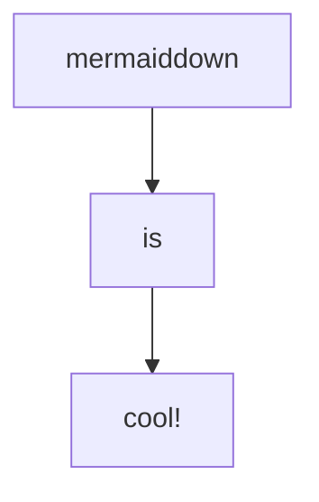

# Mermaiddown
Mermaiddown is a wrapper for [mermaid.cli] that targets markdown. Markdown files get parsed, and fenced mermaid code blocks
(`\`\`\`mermaid \`\`\``) get replaced with their corresponding mermaid diagrams in SVG format.

Inspired by the amazing concepts underlying the visual studio plugin [Markdown Preview Mermaid Support].

This operates slightly differently from other similar packages in that the SVGs are embedded into the output
HTML. This means that links in the diagram are clickable :)

[mermaid.cli]: https://npm.com/package/mermaid.cli
[Markdown Preview Mermaid Support]: https://marketplace.visualstudio.com/items?itemName=bierner.markdown-mermaid